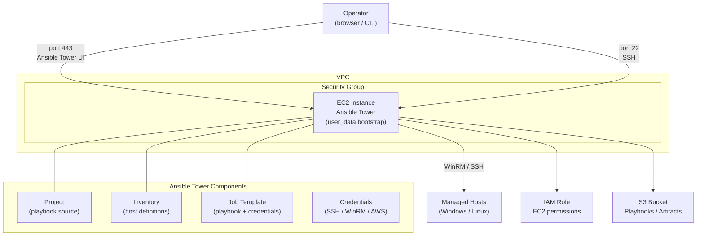

# Ansible Tower / Automation Platform Lab

Terraform templates for deploying an Ansible Tower (Red Hat Automation Platform) lab environment on AWS EC2, including IAM roles, security groups, and operational setup. Includes example playbooks for domain join and PowerShell execution.

## Architecture



## Repository Structure

```
├── ansible-tower/
│   ├── main.tf           # EC2 instance + security group + IAM
│   ├── user_data.tpl     # Bootstrap script (installs Ansible Tower)
│   ├── variables.tf      # Input variables
│   └── outputs.tf        # Output values
├── modules/
│   ├── ec2_instance/     # EC2 module
│   └── sg_security_group/ # Security group module
└── playbooks-examples/
    ├── join_domain.yml       # Example: join Windows host to AD domain
    └── powershell_execution.yml # Example: run PowerShell on Windows hosts
```

## Prerequisites

- [Terraform](https://learn.hashicorp.com/tutorials/terraform/install-cli) installed
- [AWS CLI](https://docs.aws.amazon.com/cli/latest/userguide/getting-started-install.html) configured
- Existing VPC with at least one subnet
- IAM user with admin permissions
- Red Hat account with Ansible Tower license (for activation)

## Variables to Update

| Variable | Description |
|----------|-------------|
| `vpc_id` | Target VPC ID |
| `subnet_id` | Subnet ID for EC2 placement |
| `image_id` | AMI ID (use a self-owned or RHEL AMI) |
| `key_name` | EC2 key pair name |
| `region` | AWS region |

## Usage

```shell
aws configure

terraform init
terraform plan
terraform apply --auto-approve
```

After deployment, access the Ansible Tower UI at `https://<EC2_IP>` and activate using your Red Hat account.

### Setting Up Ansible Tower

1. **Project** — configure the playbook repository path and SCM credentials
2. **Inventory** — add host IP addresses or DNS names
3. **Credentials** — add SSH, WinRM, or AWS credentials
4. **Job Template** — link project, inventory, credentials, and playbook
5. **Run** — click the rocket icon to execute the job template
