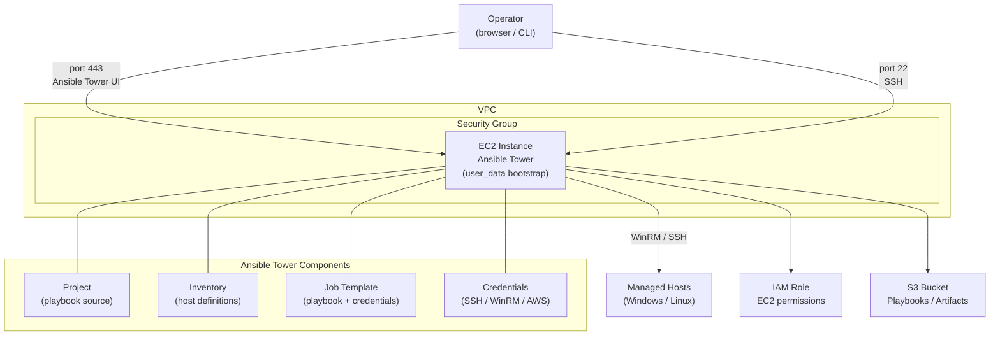

# Ansible Tower / Automation Platform Lab

Terraform templates for deploying an Ansible Tower (Red Hat Automation Platform) lab environment on AWS EC2, including IAM roles, security groups, and operational setup. Includes example playbooks for domain join and PowerShell execution.

## Architecture



## Repository Structure

```
├── ansible-tower/
│   ├── main.tf           # EC2 instance + security group + IAM
│   ├── user_data.tpl     # Bootstrap script (installs Ansible Tower)
│   ├── variables.tf      # Input variables
│   └── outputs.tf        # Output values
├── modules/
│   ├── ec2_instance/     # EC2 module
│   └── sg_security_group/ # Security group module
└── playbooks-examples/
    ├── join_domain.yml       # Example: join Windows host to AD domain
    └── powershell_execution.yml # Example: run PowerShell on Windows hosts
```

## Prerequisites

- [Terraform](https://learn.hashicorp.com/tutorials/terraform/install-cli) installed
- [AWS CLI](https://docs.aws.amazon.com/cli/latest/userguide/getting-started-install.html) configured
- Existing VPC with at least one subnet
- IAM user with admin permissions
- Red Hat account with Ansible Tower license (for activation)

## Variables to Update

| Variable | Description |
|----------|-------------|
| `vpc_id` | Target VPC ID |
| `subnet_id` | Subnet ID for EC2 placement |
| `image_id` | AMI ID (use a self-owned or RHEL AMI) |
| `key_name` | EC2 key pair name |
| `region` | AWS region |

## Usage

```shell
aws configure
 ```
2. Run the following terraform command to initialize Terraform modules 
```shell
 terraform init 
 ```
3. Run the following terraform command to plan all the infrastructure that terraform will deploy on AWS:
```shell
 terraform plan 
 ```
4. Run the following terraform command to deploy all your example modules to AWS.
```shell
 terraform apply --auto-approve 
 ```
5. Test all your AWS resources have been created by Terraform.

# Creating Ansible Tower

- To deploy Ansible Tower, we need to deploy IaC module *ansible-tower* using Terraform or terraform.

- After creating Ansible Tower IaC, we can login in the Ansible Tower Console, to activate the software (you will need your Red Hat account, with Ansible Tower license).

- Login credentials are defined on user_data.tpl script within the Ansible Tower module and they can be changed as it requerid.

- Then you would need to activate the Ansible Tower Software.


To make Ansible Tower work, we need to create basically 5 things: a project, an inventory, a hosts file, a template and the playbook that you want to run.

#### Project

In the project section, you configure the variables and paths from this project.


#### Inventory 

In the inventory, you need to put the name and the IP address of the host you want to configure 


#### Template

To configure a new Template, you need have a YAML in the path directory you define on the **Project** section.
+ **Name**: Name you'll assign to the template.
+ **Description**: A brief description of what template is doing.
+ **Inventory**: Inventory you created in the ##Inventory## section
+ **Project**: Projecto you created in the ##Project## section
+ **Playbook**: Playbook you're going to run. *(Go to playbook section for more information)*
+ **Credentials**: Credentials you'll use to execute the template.


#### Hosts

The hosts file it's just a name definition to use on the inventory. If you want to add a host, go to add botton and fill as follow:
+ **Name**: DNS Name or IP Address.
+ **Inventory**: Inventory which the host will be part
+ **Description**: A brief description of the host.  
<br>

### YAML Section
---
##### Here you can configure a YAML file that define parameters such as: 
+ hostname
+ domain
+ domainuser
+ userpass
<br>

### Playbook

For the playbook section, we need to put all the files you want to use on the project, in the path defined on the project step. Examples of playbooks are on *playbook-examples* folder.


To execute the playbook, you need to click on the rocket icon and Ansible will execute the template you defined.


terraform init
terraform plan
terraform apply --auto-approve
```

After deployment, access the Ansible Tower UI at `https://<EC2_IP>` and activate using your Red Hat account.

### Setting Up Ansible Tower

1. **Project** — configure the playbook repository path and SCM credentials
2. **Inventory** — add host IP addresses or DNS names
3. **Credentials** — add SSH, WinRM, or AWS credentials
4. **Job Template** — link project, inventory, credentials, and playbook
5. **Run** — click the rocket icon to execute the job template
